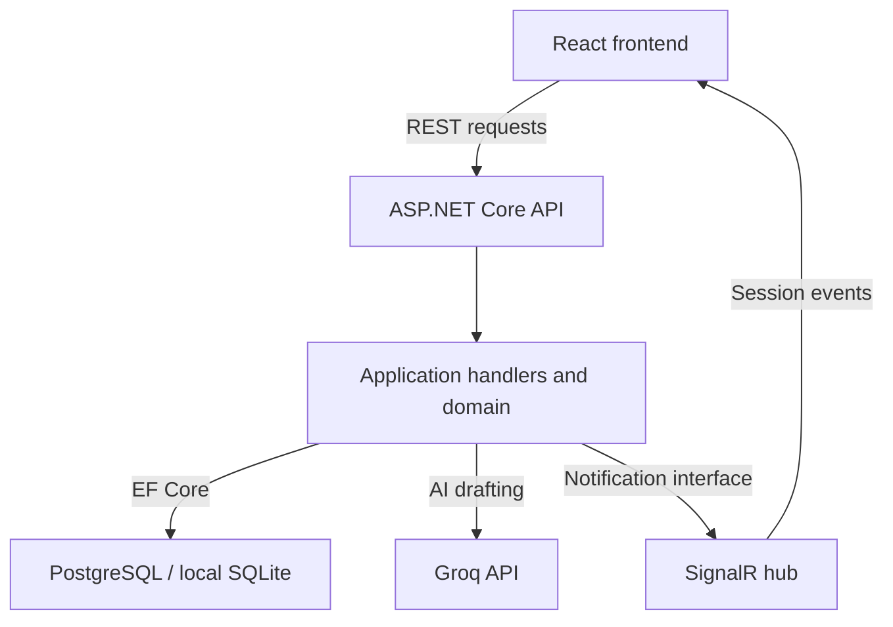
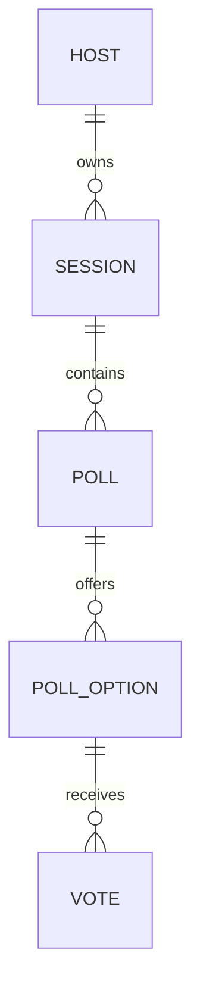

# PulseBoard

**Turn live questions into useful follow-up conversations.**

PulseBoard is a full-stack polling and knowledge-check application for developer onboarding, workshops, and team retrospectives. A host prepares a session, participants join from their browsers, and responses appear in real time. Afterward, the host can review results, identify topics to revisit, export a report, and reuse the session.

Built as a learning and portfolio project with **React, TypeScript, ASP.NET Core, SignalR, and PostgreSQL**, with optional AI-assisted question drafting through Groq.

[](https://github.com/Vishaljadaun/PulseBoard/actions/workflows/ci.yml)

[Live application](https://pulse-board-lac.vercel.app/) · [No-login demo](https://pulse-board-lac.vercel.app/demo) · [API documentation](https://pulseboard-api-rbft.onrender.com/swagger)

> The interactive demo uses labelled sample data. To try the complete workflow, register a host account and join a session from a second browser. Hosted services may need time to wake up after inactivity.

## Contents

- [The problem it solves](#the-problem-it-solves)
- [Implemented features](#implemented-features)
- [Technology stack](#technology-stack)
- [Architecture and data model](#architecture-and-data-model)
- [How the main workflows work](#how-the-main-workflows-work)
- [Run locally](#run-locally)
- [Configuration reference](#configuration-reference)
- [Deploy with Vercel, Render, and Neon](#deploy-with-vercel-render-and-neon)
- [API reference](#api-reference)
- [Testing and CI](#testing-and-ci)
- [Five-minute portfolio demo](#five-minute-portfolio-demo)
- [Engineering lessons and tradeoffs](#engineering-lessons-and-tradeoffs)
- [Current boundaries and next steps](#current-boundaries-and-next-steps)

## The problem it solves

A presenter asking “Does everyone understand?” often gets little actionable feedback. PulseBoard gives participants a quick way to respond and gives the presenter evidence for deciding what to explain next.

| Scenario | How PulseBoard helps |
| --- | --- |
| Developer onboarding | Run short .NET knowledge checks and revisit concepts with low accuracy. |
| Training workshops | Collect confidence and clarity feedback, including from participants who prefer not to speak. |
| Sprint retrospectives | Gather opinions about blockers and choose a practical improvement to discuss. |
| Repeated sessions | Copy the questions into a fresh draft and keep each session's responses separate. |

The app supports live facilitation. It is not an examination system or a verified attendance tracker.

## Implemented features

| Area | What is available |
| --- | --- |
| Host accounts | Registration, password hashing, JWT login, and protected host pages. |
| Session workspace | Create sessions, search by title/topic/join code, filter by status, and view session counts. |
| Session starters | Preview and create .NET onboarding, workshop feedback, and sprint retrospective sessions. |
| Session lifecycle | Draft → Live → Ended, with active polls closed when the session ends. |
| Question creation | Multiple-choice opinion polls or knowledge checks with an optional correct answer. |
| AI assistance | Generate a question, four choices, and a suggested correct answer; review the draft before saving. |
| Joining and sharing | Six-digit join codes, join links, QR codes, and downloadable share images. |
| Live participation | Anonymous browser participation, live response charts, and quiz feedback after submission. |
| Connection recovery | SignalR reconnection, initial connection retries, and periodic HTTP state recovery. |
| Session reuse | Owner-only duplication into a new draft with a new code and no copied votes. |
| Reporting | Owner-only aggregate results, response counts, quiz accuracy, and topics to revisit. |
| Export | CSV option breakdowns and a print layout that supports the browser's Save as PDF. |
| Persistent storage | PostgreSQL for the hosted app; SQLite remains the default for local development. |
| Public showcase | Product landing page and an interactive sample report without registration. |

## Technology stack

### Frontend

| Technology | Role in this project |
| --- | --- |
| React 19 + TypeScript 6 | Component-based UI with typed API models, props, and application state. |
| Vite 8 | Local development server and production asset build. |
| Tailwind CSS 4 | Responsive styling, spacing, typography, and shared visual patterns. |
| React Router 7 | Navigation between public, host, participant, and report pages. |
| TanStack React Query 5 | Fetching, caching, and refreshing server data after mutations. |
| Zustand 5 | Lightweight host authentication state persisted across page refreshes. |
| Axios | Shared HTTP client and bearer-token handling. |
| Microsoft SignalR client | Session event subscriptions and live result updates. |
| Framer Motion | Page transitions and UI animation. |
| qrcode.react + html-to-image | QR join codes and session share-card images. |
| Vitest + React Testing Library + jsdom | Component and behavior tests in a simulated browser environment. |
| Oxlint | Static lint checks. TypeScript checks also run during the production build. |

### Backend, storage, and delivery

| Technology | Role in this project |
| --- | --- |
| C# / .NET 8 / ASP.NET Core | REST endpoints, authentication, middleware, dependency injection, and hosting. |
| ASP.NET Core SignalR | Broadcasts poll and session events to connected clients. |
| MediatR 12 | Dispatches commands and queries to focused application handlers. |
| FluentValidation 11 | Defines request validators alongside explicit handler/domain checks. |
| Entity Framework Core 8 | Relational mapping, queries, saves, and schema migrations. |
| SQLite | Simple local development database requiring no separate server. |
| PostgreSQL + Npgsql EF provider | Persistent hosted data and relational storage outside the API container. |
| JWT bearer authentication | Signed access tokens identifying the current host. |
| ASP.NET Identity PasswordHasher | Hashes and verifies passwords; plaintext passwords are not stored. |
| Groq API + typed HttpClient | Optional server-side AI question drafting with timeouts and structured response validation. |
| Swagger / Swashbuckle | Interactive documentation for exploring the API. |
| xUnit + FluentAssertions | Backend regression and database integration tests. |
| Docker | Multi-stage build: compile with the .NET SDK and ship the ASP.NET runtime. |
| GitHub Actions | Backend build/tests and frontend lint/tests/build on pushes and pull requests. |
| Vercel / Render / Neon | Frontend hosting, containerized API hosting, and hosted PostgreSQL respectively. |

Exact package versions are recorded in the backend `.csproj` files and the frontend [package manifest](PulseBoard-Frontend/package.json) and lockfile.

## Architecture and data model

The backend follows a layered architecture. Controllers handle HTTP concerns, application handlers coordinate use cases, domain entities hold state and behavior, and infrastructure implements persistence and external services.



The diagram shows runtime interactions. In the code, application interfaces such as `IApplicationDbContext`, `IPollAiGenerator`, and `ISessionHubNotifier` keep handlers separate from concrete adapters. Dependency injection connects these implementations in the API's composition root. The application layer uses EF Core abstractions; it is not completely persistence-library independent.

### Repository guide

| Location | What to explore |
| --- | --- |
| [Domain](PulseBoard-Backend/src/PulseBoard.Domain) | Host, session, poll, option, and vote entities; status enums and lifecycle behavior. |
| [Application](PulseBoard-Backend/src/PulseBoard.Application) | Commands, queries, handlers, DTOs, validators, interfaces, and application exceptions. |
| [Infrastructure](PulseBoard-Backend/src/PulseBoard.Infrastructure) | EF contexts and migrations, database selection, password hashing, JWT creation, and Groq integration. |
| [API](PulseBoard-Backend/src/PulseBoard.API) | Controllers, SignalR hub, current-user service, exception middleware, and startup configuration. |
| [Backend tests](PulseBoard-Backend/tests/PulseBoard.Application.Tests) | Lifecycle, report, starter, duplication, AI, and persistence regressions. |
| [Frontend source](PulseBoard-Frontend/src) | Pages, reusable components, API clients, live-session hook, auth store, and report utilities. |
| [CI workflow](.github/workflows/ci.yml) | Repeatable backend and frontend verification, including a PostgreSQL service. |
| [Documentation](docs) | Detailed setup, training workflow, and future product direction. |

### Relational model



- **Host:** name, unique email, password hash, and creation time.
- **Session:** owning host, title, topic, unique join code, status, and lifecycle timestamps.
- **Poll:** parent session, question, status, and activation/closure timestamps.
- **PollOption:** option text and an optional correct-answer flag.
- **Vote:** selected option, browser participant ID, and submission time.

Participants do not have a separate account table. Their browser identifier is stored with votes. The database has a unique `(PollOptionId, ParticipantId)` index; enforcing uniqueness across *all options of a poll* under concurrent requests remains future work.

## How the main workflows work

### 1. Authentication and ownership

Registration stores a password hash and returns a JWT. Login verifies the stored hash and issues a token containing the host ID in the `sub` claim. The frontend persists authentication state with Zustand and attaches the token to API requests through Axios.

Authentication establishes who the host is. Ownership checks in application handlers determine whether that host may access a particular session, report, or copy operation. A successful login alone does not grant access to another host's workspace.

Participants join without registering. Their browser-generated IDs support response tracking, but do not establish a verified identity. JWT expiration can require another login; it should not require another registration.

### 2. Session and poll lifecycle

A session begins in **Draft**, moves to **Live** when started, and finishes as **Ended**. Polls move through **Draft**, **Active**, and **Closed**.

Activation and voting require a live session. Ending a session closes its active polls in the same database save, then notifies connected participants. Creating questions or requesting AI drafts for ended sessions is rejected. These checks exist on the backend as well as in the UI.

### 3. Real-time voting and recovery

1. The participant resolves a join code and loads the current session state over HTTP.
2. The browser joins the session's SignalR group through `/hubs/session`.
3. The host activates a poll; the server broadcasts `PollActivated`.
4. A participant submits a vote through REST. The handler checks session/poll state and saves the vote.
5. The server broadcasts updated totals using `PollResultsUpdated`.
6. `PollClosed` and `SessionEnded` keep connected screens aligned with the lifecycle.

SignalR delivers notifications; the database remains the source of truth. The frontend retries connections and periodically retrieves HTTP snapshots to recover missed events. It also guards against stale HTTP responses overwriting newer event state. This is connection recovery, not an offline voting queue.

### 4. AI-assisted drafting

The frontend sends a topic to the backend. A typed `HttpClient` calls Groq's OpenAI-compatible chat-completions endpoint with a 20-second timeout. The default model configured by this project is `openai/gpt-oss-20b`, overridable through `Ai:Model`.

The response must contain a question of at most 300 characters, exactly four distinct nonblank options of at most 120 characters, and a valid correct-answer index. The backend rejects malformed output and distinguishes configuration failures, rate limits, timeouts, and unavailable-provider errors.

The result fills a draft for the host to review and edit. It does **not** publish a question automatically, and structural validation does not establish factual correctness. Manual questions and built-in starters work without an AI key. See [AI setup](docs/AI_SETUP.md).

### 5. Reports and follow-up

Reports aggregate saved responses and are available to the owning host. They show:

- Distinct responding browser IDs, rather than attendance or named learners.
- Total responses, per-option counts, and question-level results.
- Quiz accuracy calculated as `100 × correct quiz responses / total quiz responses`.
- Closed knowledge checks below a selected accuracy threshold as topics to revisit.

Opinion polls are excluded from quiz accuracy. Questions with no responses have no accuracy value rather than a misleading zero. Overall accuracy is weighted by responses, not an unweighted average of question percentages.

Follow-up suggestions are rule-based, not AI-generated lesson plans. Reports are refreshable snapshots. CSV exports contain aggregate option data and answer keys, escape CSV characters, and neutralize spreadsheet formula prefixes. PDF saving uses the browser print dialog.

### 6. Persistence across deployments

SQLite is convenient locally, but a database file inside a temporary hosted container can disappear when the container is replaced. PostgreSQL stores accounts, sessions, questions, and votes separately from the Render API container.

The selected EF context applies migrations at startup. SQLite and PostgreSQL have separate migration histories and model snapshots. Invalid PostgreSQL configuration fails startup instead of silently falling back to SQLite. A new PostgreSQL database starts empty: the provider switch does not migrate existing SQLite records or recover previously lost accounts.

## Run locally

### Prerequisites

- Git
- .NET 8 SDK
- Node.js 22.12+ with npm; CI uses Node 22
- Optional Groq API key for AI drafting

No PostgreSQL installation is needed for the default SQLite setup.

### 1. Clone the repository

```bash
git clone https://github.com/Vishaljadaun/PulseBoard.git
cd PulseBoard
```

### 2. Start the backend

From the repository root:

```bash
cd PulseBoard-Backend/src/PulseBoard.API

# Replace this placeholder with your own strong random secret (32+ characters).
dotnet user-secrets set "Jwt:Secret" "YOUR_RANDOM_SECRET_AT_LEAST_32_CHARACTERS"

# Optional: only needed for AI drafting.
dotnet user-secrets set "Ai:GroqApiKey" "YOUR_GROQ_API_KEY"

dotnet dev-certs https --trust
dotnet run
```

The launch profile sets the environment to `Development`. EF Core applies migrations and creates the local SQLite database on first startup.

- API: `https://localhost:7050`
- Swagger: `https://localhost:7050/swagger`
- SignalR: `https://localhost:7050/hubs/session`

If HTTPS certificate trust is unavailable on your machine, the development launch profile also exposes `http://localhost:5050`. Use that origin for both frontend API and hub settings during local development.

### 3. Start the frontend

In a second terminal, from the repository root:

```bash
cd PulseBoard-Frontend
npm ci
npm run dev
```

Open `http://localhost:5173`. The committed `.env.development` already points to the local HTTPS backend. For machine-specific changes, create `.env.development.local` using [.env.example](PulseBoard-Frontend/.env.example) as a reference. Restart Vite after changing variables.

Register a host, create a session, start it, activate a question, and join from another browser or a private window to test the participant flow.

## Configuration reference

ASP.NET Core maps double underscores in environment variable names to nested configuration keys: `Jwt__Secret` corresponds to `Jwt:Secret`. Use .NET user secrets for local secrets and hosting environment settings for deployment secrets.

### Backend

| Environment variable | Purpose / value |
| --- | --- |
| `ASPNETCORE_ENVIRONMENT` | `Development` locally; `Production` when hosted. |
| `Jwt__Secret` | Strong random signing secret, at least 32 characters; keep private and stable across restarts. |
| `AllowedOrigin` | Exact frontend origin, e.g. `http://localhost:5173` or `https://pulse-board-lac.vercel.app`; no trailing slash. |
| `Database__Provider` | `Sqlite` by default; set `PostgreSQL` for the hosted database. |
| `ConnectionStrings__DefaultConnection` | SQLite connection, default `Data Source=pulseboard.db`; not used for PostgreSQL. |
| `ConnectionStrings__PostgreSqlConnection` | Private .NET/Npgsql connection string; required when PostgreSQL is selected. |
| `Ai__GroqApiKey` | Optional private Groq key; required only for AI drafting. |
| `Ai__Model` | Optional model override; project default `openai/gpt-oss-20b`. |

JWT issuer, audience, and expiry settings are also defined in the API configuration. Keep token generation and validation settings consistent.

PostgreSQL connection example using placeholders only:

```text
Host=YOUR_NEON_HOST;Port=5432;Database=YOUR_DATABASE;Username=YOUR_ROLE;Password=YOUR_PASSWORD;SSL Mode=VerifyFull;Maximum Pool Size=10;Timeout=30;Command Timeout=30
```

This application expects **.NET key/value format**, not a `postgresql://...` URL or a `psql` command. See the [database guide](docs/DATABASE_SETUP.md) for connection details, escaping special characters, cutover, and migration instructions.

### Frontend

| Environment variable | Local default | Hosted example |
| --- | --- | --- |
| `VITE_API_BASE_URL` | `https://localhost:7050/api` | `https://pulseboard-api-rbft.onrender.com/api` |
| `VITE_SIGNALR_HUB_URL` | `https://localhost:7050/hubs/session` | `https://pulseboard-api-rbft.onrender.com/hubs/session` |

`VITE_` variables are public values embedded in the browser build. Never put the database connection string, JWT signing secret, or Groq key in them. Rebuild/redeploy the frontend after changing these values.

## Deploy with Vercel, Render, and Neon

| Component | Service | Deployment settings |
| --- | --- | --- |
| Frontend | Vercel | Root `PulseBoard-Frontend`; build `npm run build`; output `dist`. |
| Backend | Render | Docker service with root/build context `PulseBoard-Backend` and its `Dockerfile`. |
| Database | Neon | PostgreSQL connection configured privately on the Render backend. |

1. **Create the database.** Obtain the PostgreSQL host, database, role, and password. Follow [DATABASE_SETUP.md](docs/DATABASE_SETUP.md) to build the Npgsql connection string.
2. **Configure Render.** Set `Database__Provider=PostgreSQL`, the PostgreSQL connection string, `Jwt__Secret`, `AllowedOrigin`, and optional AI settings. The Docker entrypoint uses Render's `PORT` value, with 8080 as a fallback.
3. **Deploy the API.** Check that migrations complete using `Npgsql.EntityFrameworkCore.PostgreSQL` and the service starts successfully.
4. **Configure Vercel.** Set both frontend URLs to your deployed API and hub. The included `vercel.json` rewrites client-side routes to the SPA entry point.
5. **Verify the full flow.** Register, create a session, join from another browser, vote, end, and inspect the report. Then restart the backend and confirm the same account and session remain accessible.

GitHub Actions verifies builds and tests. Deployment is handled separately by the Vercel and Render repository integrations. For schema/API changes, deploy a compatible backend before the frontend that requires it.

### Common setup issues

| Symptom | What to check |
| --- | --- |
| Account disappears after redeployment | Confirm PostgreSQL is selected and the connection still targets the same database. SQLite on a temporary container is not persistent storage. |
| AI generation fails | Check the backend Groq key, configured model, and provider limit/error message. Manual creation still works. |
| Browser requests fail with CORS errors | Match backend `AllowedOrigin` to the exact frontend origin and check both frontend URLs. |
| Local HTTPS request fails | Trust the development certificate, or use the local HTTP port for both frontend URLs. |
| Hosted page refresh returns 404 | Check the Vercel project root and included SPA rewrite configuration. |
| PostgreSQL startup fails | Use Npgsql key/value syntax, correct credentials/host, and the SSL settings described in the database guide. |

## API reference

REST paths below are relative to `/api`. `Owner` means an authenticated host with ownership of the target session. Consult [Swagger](https://pulseboard-api-rbft.onrender.com/swagger) for request and response schemas.

| Method | Path | Access | Purpose |
| --- | --- | --- | --- |
| POST | `/auth/register` | Public | Register a host and receive a JWT. |
| POST | `/auth/login` | Public | Authenticate and receive a JWT. |
| GET | `/sessions` | Host | List the current host's sessions. |
| POST | `/sessions` | Host | Create a draft, optionally with starter questions. |
| GET | `/sessions/{id}` | Owner | Get session details. |
| POST | `/sessions/{id}/start` | Owner | Start a draft session. |
| POST | `/sessions/{id}/end` | Owner | End a session and close active polls. |
| POST | `/sessions/{id}/duplicate` | Owner | Create an independent draft copy. |
| GET | `/sessions/{id}/report` | Owner | Retrieve aggregate results. |
| GET | `/sessions/join/{joinCode}` | Public | Resolve a participant join code. |
| GET | `/sessions/{id}/status` | Public | Retrieve participant lifecycle state. |
| GET | `/sessions/{sessionId}/polls` | Owner | List host question details. |
| POST | `/sessions/{sessionId}/polls` | Owner | Create a poll. |
| POST | `/sessions/{sessionId}/polls/generate` | Owner | Request an AI draft. |
| POST | `/polls/{pollId}/activate` | Owner | Activate a poll in a live session. |
| POST | `/polls/{pollId}/close` | Owner | Close a poll. |
| GET | `/sessions/{sessionId}/polls/active` | Public | Retrieve the active participant question. |
| GET | `/polls/{pollId}/results` | Public | Retrieve aggregate live tallies. |
| POST | `/polls/{pollId}/vote` | Public | Submit a browser participant's selection. |

Host REST requests use `Authorization: Bearer <token>`. The public participation endpoints and session hub support anonymous joining; session IDs and join codes are not a private-assessment security boundary.

The SignalR hub is `/hubs/session`, outside `/api`. Clients call `JoinSession(sessionId)` and `LeaveSession(sessionId)` and listen for `PollActivated`, `PollResultsUpdated`, `PollClosed`, and `SessionEnded`.

## Testing and CI

### Backend

From the repository root:

```bash
dotnet restore PulseBoard-Backend/PulseBoard.sln
dotnet build PulseBoard-Backend/PulseBoard.sln --configuration Release --no-restore
dotnet test PulseBoard-Backend/PulseBoard.sln --configuration Release --no-build
```

Tests cover session/poll lifecycle rules, report ownership and calculations, starter validation, independent session copies, AI error/response handling, and database configuration.

CI also starts PostgreSQL 16 and runs a persistence integration test. It creates a disposable database, applies migrations, registers a host, records a session and vote, destroys the application service provider, then creates a fresh provider. The test verifies login, retained results, repeated migration, and a vote-free session copy.

For this test locally, `PULSEBOARD_TEST_POSTGRES` must reference a **dedicated disposable test server** with database-creation privileges. Never point it at production. Without that variable, this PostgreSQL integration test is skipped; CI supplies it explicitly.

### Frontend

From the repository root:

```bash
cd PulseBoard-Frontend
npm ci
npm run lint
npm test
npm run build
```

Tests cover AI error presentation, reconnect and lifecycle synchronization, stale-response protection, report/CSV behavior, the demo, and retrying starter creation. These are component and behavior tests, not a complete browser-to-production acceptance suite.

The [GitHub Actions workflow](.github/workflows/ci.yml) runs separate backend and frontend jobs for pull requests, pushes to `main` and `codex/**`, and manual dispatches. See the workflow results for the current build status.

## Five-minute portfolio demo

1. **Explain the scenario:** “A trainer wants to find which onboarding concepts need another example.”
2. **Show the public demo:** open `/demo` and explain that it uses sample data.
3. **Create a real session:** sign in and choose the .NET onboarding starter.
4. **Run it live:** start the session, share its join code/QR, and join from another browser.
5. **Collect responses:** activate a question, submit a response, and show the live chart and quiz feedback.
6. **Close the loop:** end the session, open its report, explain weighted accuracy, and export a CSV.
7. **Show reuse and architecture:** duplicate the session, confirm it starts as a fresh draft, and walk through a handler, the SignalR hook, and the CI workflow.

For a longer walkthrough, see [Training workflow](docs/TRAINING_WORKFLOW.md).

## Engineering lessons and tradeoffs

| Design choice | What this project demonstrates |
| --- | --- |
| Focused commands and queries | Separates use cases without introducing separate read/write databases or event sourcing. |
| REST plus SignalR | HTTP handles commands and recoverable snapshots; events make connected screens responsive. |
| Server cache vs. client state | React Query manages fetched data while Zustand holds authentication state. |
| Domain lifecycle checks | Disabled buttons improve UX, but backend rules still protect invalid transitions. |
| Two database providers | Local convenience and hosted durability require explicit configuration and provider-specific migrations. |
| AI as a draft assistant | External output is structurally validated and reviewed by a human before use. |
| Aggregate reporting | Weighted metrics, unanswered questions, and anonymous identities require careful interpretation. |
| Independent persistence test | Recreating the service provider checks that data survives outside application memory. |

JWTs are currently stored in browser local storage, which is convenient for the demo but makes XSS prevention especially important. Startup migrations suit the current single-instance deployment; multiple replicas would need a coordinated migration step. These are deliberate scope choices to understand and revisit as the application grows.

## Current boundaries and next steps

PulseBoard demonstrates a working facilitation workflow. It is still a portfolio project with known improvement areas:

- **Voting integrity:** enforce one vote per poll at the database level under concurrent requests, and coordinate competing activation/end/vote operations.
- **Identity and account recovery:** browser IDs are not verified learners; refresh tokens, email verification, and password reset are not implemented.
- **Authoring:** a saved question bank and edit/delete/archive workflows are future work. Current draft editing happens before question creation.
- **Verification:** add a full automated two-browser acceptance flow, load testing, and deployment health checks; verify backup/restore and production restart persistence operationally.
- **Product expansion:** organization workspaces, assigned learning, document-grounded AI, billing, and an embeddable commercial module are ideas, not existing features.

See [COMPLETION.md](COMPLETION.md) for milestones and acceptance checks and [Product direction](docs/PRODUCT_DIRECTION.md) for the proposed commercial scope.

### Further reading

- [AI configuration and troubleshooting](docs/AI_SETUP.md)
- [Neon/PostgreSQL and Render persistence setup](docs/DATABASE_SETUP.md)
- [Training workflow and reporting interpretation](docs/TRAINING_WORKFLOW.md)
- [Product direction and validation plan](docs/PRODUCT_DIRECTION.md)

Built by [Vishal Jadaun](https://github.com/Vishaljadaun) as a full-stack learning and portfolio project.
